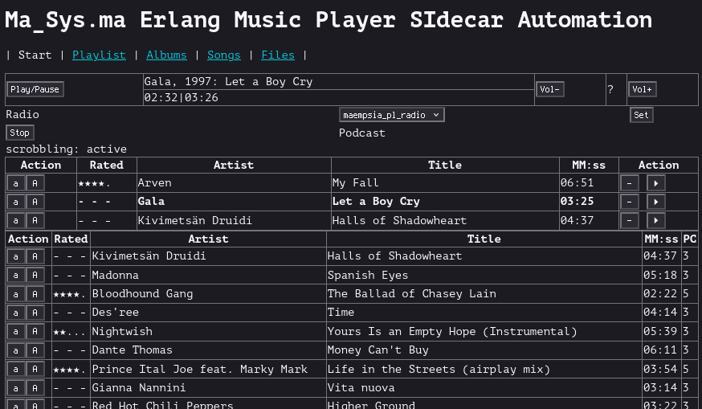

Background
==========

After upgrading my audio setup (cf.
[aes67_music_listening(37)](../37/aes67_music_listening.xhtml), the need for the
_multi-player_ capabilities of [maenmpc(32)](../32/maenmpc.xhtml) was eliminated
as only one player was in use at the same time.

Also, the Rust-based client RMPC (<https://rmpc.mierak.dev/>) was discovered
and found to provide a configurable Terminal User Interface that could be
configured to mimic MAENMPC rather closely. The RMPC TUI has lower latency and
supports useful additional features compared to MAENMPC. E. g. RMPC supports
browsing files and can display synchronized lyrics for songs. In summary, this
made it a strong candidate client to prefer for interactive usage.

Together with some ideas to revise the algorithms and features of MAENMPC
(e. g. to get its playlist generation working on a phone without running into
timeouts) it was decided to split selected remaining MAENMPC-exclusive features
into a new, smaller “sidecar” client which could run in parallel to RMPC to
replace MAENMPC.

The resulting client is MAEMPSIA which is an acronym for
_Ma_Sys.ma Erlang Music Player SIdecar Automation_.

Abstract
========

MAEMPSIA is an experimental server-based MPD client. It is intended to run in
parallel to a primary/interactive MPD client and as such, only very limited
interactive functionality and focuses on background tasks which are typically
not found in interactive clients.

ratings
:   Full support for ratings by using the MPD stickers database.
    This includes song and album ratings.
    It is mostly not intended to use the song ratings interactively from
    MAEMPSIA but they are processed by the _playlist generation_ feature.
play counts
:   Support for song play counts via the `playCount` sticker in the MPD database.
    Additionally, an automatic updating of `playCount` stickers from a
    Maloja instance is possible.
scrobbling
:   Support for scrobbling to a Maloja server or JSON file. The JSON file uses
    the data format of the Maloja API such that it can later be easily imported
    to Maloja.
news podcasts
:   Support for news podcasts which are automatically enqueued into the playlist
    as a new episode appears.
playlist generation
:   Support for generating “radio-like” playlists based on the ratings and
    play counts. This is a new algorithm compared to MAENMPC which attempts to
    solve the same problem slightly differently with different tradeoffs in
    terms of performance and quality.
web interface
:   A minimalist web interface (see screenshot) is provided to browse the full
    song database and enable/disable server features at runtime. The design idea
    behind this interface is to not offer buttons that replace the whole
    playlist. This is intended to enable usage on the phone e. g. from inside
    cars or buses without fat-fingering playlist deletion. In practice, this
    interface may be too slow to be generally usable on a phone.

Compared to MAENMPC, the status of above listed features is as follows:

Feature              MAENMPC  MAEMPSIA  Notable Differences
-------------------  -------  --------  -----------------------------------------------------------------------------------------
ratings              Y        Y         MAEMPSIA supports album ratings in addition to song ratings
play counts          Y        Y         MAEMPSIA maintains playCount stickers, MAENMPC supports those only in a read-only fashion
scrobbling           Y        Y         none
news podcasts        Y        Y         MAEMPSIA has removed some multi-player related advanced stuff like the SSH client
playlist generation  Y        Y         MAEMPSIA uses a modified algorithm (see below)
web interface        N        Y         New feature with fewer capabilities compared to the TUI of MAENMPC

WARNING - Maintenance Status
============================

As an experimental client, MAEMPSIA is not recommended for general usage. Of
course, it is free software so you may use it subject to the license. Keep in
mind that due to the reasons outlined below, the documentation here is
incomplete and primarily serves for my own reference.

It is not clear if MAEMPSIA will be a “daily driver” or is only a step towards
replicating some of the features to RMPCD
(<https://github.com/mierak/rmpc/tree/master/rmpcd>).
Specifically, RMPCD very much looks like it is designed to solve the same
problem as MAEMPSIA i. e. providing a sidecar server which runs those tasks
which are not nice to integrate with an interactive player. Given its extensible
nature with Lua scripting, it could be possible to replace MAEMPSIA with RMPCD
plugins.

Whether MAEMPSIA is here to stay is thus dependent on whether there is some
advantage to be gained from RMPCD integration in favor of the completely
separate client and whether it is worth maintaining a completly own client to
benefit from some niche advantages that MAEMPSIA might provide over RMPCD for
the Ma_Sys.ma use cases.

Setup Instructions
==================

The setup is similar to the one described for
[maenmpc(32)](../32/maenmpc.xhtml) as MAEMPSIA uses a similar technical
foundation: It is also built using Erlang.

## Installation on Debian-based OS

### Compile-Time Dependencies

	apt install ant devscripts erlang-base erlang-jiffy erlang-inets erlang-mochiweb rebar3 git

### Compile and Install

	ant package
	sudo apt install ../*.deb

## Installation using Rebar3

This is also the way to get MAEMPSIA to run on a smartphone using Termux!

### Required Dependencies

	rebar3

### Setup Instructions

Uncomment the commented-out lines in `rebar.config`, then compile MAEMPSIA
using:

	rebar3 release

After successful compilation, run MAEMPSIA:

	./_build/default/rel/maempsia/bin/maempsia foreground

Configuration
=============

Like MAENMPC, MAEMPSIA requires configuration to run successfully. An example
configuration is supplied as `config/sys.config` along the source code of the
program. Unless a command-line argument `-config <FILE>` is given, this config
file is used automatically.

Local changes can be performed on a copy which is passed via the `-config` CLI
argument or directly on the source file level before compiling.

~~~{.erlang}
[{maempsia, [
	{mpd, #{
		ip              => {"127.0.0.1", 6600}
	}},
	{webserver, #{
		ip              => {127, 0, 0, 1},
		port            => 9444
	}},
	{webinterface, #{
		files           => [
				<<"/proc/asound/RAVENNA/pcm0p/sub0/hw_params">>,
				<<"/tmp/maempsia.log">>
				]
	}},
	{radio, #{
		schedule_len    => 60,
		filter          => {land, [
					{lnot, {base, "epic"}},
					{lnot, {land, [
						{tagop, artist, eq, ""},
						{tagop, album,  eq, ""},
						{tagop, title,  eq, ""}
					]}}
				]}
	}},
	{playlist_gen, #{
		maempsia_pl_radio => #{
			pattern => [1, 1, 1, 2, 1, 1, 1, 2, 1, 0, 1, 2]
		}
	}},
	{maloja, #{
		url             => "http://127.0.0.1:42010/",
		key             => "NKPCt5Ej7vkilkRtx5EubIa4fG78xhPEbcljU49rHVjDUgV5WmEHl3VDHjZFDrQK",
		ignore_file     => "/data/programs/music2/supplementary/maempsia/ignore_scrobbles.config",
		scrobble_active => true,
		interval        => 28000,
		use_album_art   => true,
		scrobble_file   => "scrobble_test.txt"
	}},
	{podcast, #{
		conf            => "/data/programs/music2/supplementary/news/conf",
		glob            => "/data/programs/music2/supplementary/news/pod/**/*.mp3",
		timeout         => 50000,
		interval        => 300000,
		target_fs       => "/data/programs/music2/epic/x_podcast/podcast.mp3",
		target_mpd      => "epic/x_podcast/podcast.mp3"
	}}
]},
{kernel, [
	{logger_level, info},
	{logger, [
		{handler, default, logger_std_h, #{
			level     => warning,
			formatter => {logger_formatter, #{single_line => true}}
		}},
		{handler, info, logger_std_h, #{
			level     => info,
			config    => #{file => "/tmp/maempsia.log"}
		}}
	]}
]}].
~~~

Section `mpd`
:   Configure the MPD to connect to. The default may work in many cases.
Section `webserver`
:   Configure the port of the web interface. The default (9444) may work in
    many cases.
Section `webinterface`
:   Configures some files which can be viewed in the _Files_ tab in the web
    interface. This is most useful for viewing the MAEMPSIA log files but may
    also help to check the ALSA parameters as shown in the example config.
Section `radio`
:   General settings for playlist generation.
    The `schedule_len` is the default length of the playlist to generate where
    the default (60 songs) may be OK for many cases.
    The `filter` is an MPD filter in [erlmpd(32)](../32/erlmpd.xhtml) syntax.
    The example configures to exclude the top-level directory `epic` and any
    songs for which there is either no Artist, Album or no (song) Title
    metadata assigned. Refer to the MPD protocol and ERLMPD documentation to
    find out about the capabilites and syntax of filters.
Section `playlist_gen`
:   Configures playlist generation algorithms. At the time of this writing,
    there is only one algorithm `maempsia_pl_radio` which is configured by
    specifying a `pattern`. See Section _Radio Playlist Generation Algorithm_
    for details
Section `maloja`
:   This configures the Maloja server to use with the fields having the same
    meanings as for MAENMPC. Most users must change `use_album_art` to `false`
    because this setting works with a pre-release PR applied on top of an
    older Maloja code base.... Remove `url` and `key` to generate JSON
    scrobbles at `scrobble_file` instead of directly scrobbling to Maloja.
    The `ignore_file` can be used to exclude some patterns from the
    synchronization of `playCount` stickers with Maloja. This is mostly useful
    to identify songs which are not in the MPD database but for which scrobbles
    exist in Maloja. The advantage of keeping such a list compared to the
    default behaviour where MAEMPSIA prints messages to the log files upon
    encountering such a scrobble is that it may help focusing attention on
    actual failures to synchronize e. g. if a song is scrobbled under a slightly
    different spelling in Maloja it may assign the scrobbles there but MAEMPSIA
    may not find them, leading to skewed `playCount` tracking under some
    circumstances.
Section `podcast`
:   Configures podcasts to automatically check using the `podget` program which
    must be installed and available in the `$PATH`. This is similar to
    MAENMPC except that no SSH connection and no resampling can be configured
    here.
Section `logger`
:   Configures the locations of log files where MAEMPSIA prints status
    information. Also, the log level can be set near this section to get more
    (`debug`) or less (`warning`) verbose output in the log file.

Example `ignore_file` contents:

~~~{.erlang}
[
	{<<"deutschlandfunk">>, <<"deutschlandfunk">>, any},
	{<<"deutschlandfunk">>, <<"aktuelles">>,       any},
	{<<"snow patrol">>,     <<"eyes open">>,       <<"chasing cars">>},
].
~~~

The syntax of each entry is Artist/Album/Title e. g. here some podcast episodes
are excluded from the synchronization in addition to the song _Chasing Cars_
by Artist _Snow Patrol_ from Album _Eyes Open_. This song was present at a past
time in the MPD database but play counts cannot be synchronized because it
doesn't exist in the MPD database right now. Hence put it in the `ignore_file`
to avoid being warned about this particular entry on each synchronization. The
special value `any` can be used to exclude all entries where the preceding
fields match i. e. there need not be a particular Title assigned to exclude the
podcast episodes.

Command Line Interface Syntax
=============================

The CLI syntax is very similar to MAENMPC except that some options have not been
ported to MAEMPSIA.

~~~
USAGE maempsia [-skip-sync] [-radio [GEN]] -- run regularly
USAGE maempsia -help                       -- this page
USAGE maempsia -sync-playcounts            -- sync playcounts then exit
USAGE maempsia -import-scrobbles JSON      -- import scrobbles from file
USAGE maempsia -generate-schedule M3U [-generator GEN] [-length COUNT]
                                           -- generate playlist schedule

-skip-sync         Don't synchronize playCount sticker from Maloja on startup
-radio GEN         Start radio service with defined algorithm (see config)
-sync-playcounts   Synchronize playCount from Maloja (only)
-import-scrobbles  Import scrobbles from JSON file. Such file is generated if
                   `maloja/key` is absent in config. Does not update MPD.
~~~

Radio Playlist Generation Algorithm
===================================

The idea behind the radio playlist is to follow a random shuffle of songs
establishing that within a short time frame of listening (here measured in
songs) a nice song occurs and also that the songs with low play counts are
generally preferred such that repeating the scheme eventually causes the whole
song database to be played.

I. e. it is a shuffle scheme with certain biases to make the random playlist
more enjoyable to listen to.

### Old Algorithm

The algorithm introduced with [gmusicradio(32)](../32/gmusicradio.xhtml) and
also ported to MAENMPC was based on the following general ideas:

 * Assemble songs into lists grouped by rating and then by play count.
 * Shuffle these lists, keeping a preference to put the low play counts in
   front.
 * If there are too many “mediocre rated” songs compared to “nicely rated” ones,
   duplicate the nicely rated songs list.
 * Merge the lists together, choosing which list to operate on based on how
   far the relative progress in the respective list is i. e. prefer to append
   from the list of least progress.

This was rooted in the assumption that in the general case, the whole songs
database should be processed hence this list-centric view. Also, in the
typical case of not repeating the nicely rated list, this would cause no song
to be repeated but also if there was some “below average” rated songs they
were merged without considering them in the repetition scheme causing the
generated playlist to sometimes prefer playing back below average songs with
unexpectedly high frequency.

### New Algorithm

The new algorithm by MAEMPSIA is simpler and at the same time addresses some of
the shortcomings of the old one.

It generally works as follows:

 * Assemble songs into lists grouped by rating.
 * Shuffle each of these lists.
 * Set current play count to 0, use a pattern to specify when to play songs of
   which rating.
 * Repeat the pattern until the requested number of playlist entries has been
   output, getting one rating from the pattern to identify the next list to
   chose from:
    * Find the first song with the current rating and play count in the list
    * If there is none, increment play count and retry without advancing in
      the pattern. (Note that for this algorithm to terminate, each list by
      rating must contain at least one song!)
    * If a song was found, output it as playlist entry and increment its play
      count in the list. (This makes it eligible for being played back again
      with the incremented play count resulting from having this song in the
      playlist once already)

An obvious weakness of this algorithm shows if are a few songs in the database
which have a much lower play count compared to the remainder of the database:
In event of adding new music to the database this algorithm repeats the new
songs more often. In general, it is thus required to achieve higher accuracy in
updating the MPD play counts otherwise the playlists may become boring rather
quickly.

Apart from that, this algorithm is surprisingly simple and generally achieves
better playlists compared to the preceding approach. It is also easier to
fine-tune because the pattern can be of any shape or length desired.

E. g. the default pattern is as follows:

	[1, 1, 1, 2, 1, 1, 1, 2, 1, 0, 1, 2]

The numbers 0, 1, 2 are used to encode:

 * 0 - lower than average (2 stars).
   1 star or less excludes the song from the playlist generation automatically.
 * 1 - average (3 stars or not rated)
 * 2 - above average (4 or 5 stars).
   No distinction is made between 4 or 5 stars because usually, the play count
   consideration will be enough to ensure that 5 stars songs are played only on
   rare occasions (I typically enqueue my favorite songs manually and in general
   they have much higher play counts than the others)

An example playlist using this pattern looks as follows (excerpt from w3m
rendering of the MAEMPSIA web interface):

~~~
┌──────┬─────┬─────────────────┬─────────────────────────────────────┬─────┬──┐
│Action│Rated│     Artist      │                Title                │MM:ss│PC│
├──────┼─────┼─────────────────┼─────────────────────────────────────┼─────┼──┤
│[a][A]│- - -│Madonna          │Like a Virgin                        │03:10│3 │
├──────┼─────┼─────────────────┼─────────────────────────────────────┼─────┼──┤
│[a][A]│- - -│Pink Floyd       │Goodbye Blue Sky                     │02:47│3 │
├──────┼─────┼─────────────────┼─────────────────────────────────────┼─────┼──┤
│[a][A]│- - -│Limp Bizkit      │Re‐Entry                             │02:38│3 │
├──────┼─────┼─────────────────┼─────────────────────────────────────┼─────┼──┤
│[a][A]│★★★★.│Atargatis        │4 Giving                             │01:14│5 │
├──────┼─────┼─────────────────┼─────────────────────────────────────┼─────┼──┤
│[a][A]│- - -│Temperance       │Goodbye                              │03:48│3 │
├──────┼─────┼─────────────────┼─────────────────────────────────────┼─────┼──┤
│[a][A]│- - -│Madonna          │Dress You Up                         │04:02│3 │
├──────┼─────┼─────────────────┼─────────────────────────────────────┼─────┼──┤
│[a][A]│- - -│Wir sind Helden  │Müssen nur wollen                    │03:36│3 │
├──────┼─────┼─────────────────┼─────────────────────────────────────┼─────┼──┤
│[a][A]│★★★★.│Sting            │Russians                             │03:58│5 │
├──────┼─────┼─────────────────┼─────────────────────────────────────┼─────┼──┤
│[a][A]│- - -│Beyond the Black │In the Shadows                       │04:54│3 │
├──────┼─────┼─────────────────┼─────────────────────────────────────┼─────┼──┤
│[a][A]│★★...│Lyriel           │My Favourite Dream                   │03:49│3 │
├──────┼─────┼─────────────────┼─────────────────────────────────────┼─────┼──┤
│[a][A]│- - -│Mr Hudson        │Straight No Chaser                   │03:29│3 │
├──────┼─────┼─────────────────┼─────────────────────────────────────┼─────┼──┤
│[a][A]│★★★★.│Britney Spears   │Oops! I Did It Again                 │03:32│5 │
└──────┴─────┴─────────────────┴─────────────────────────────────────┴─────┴──┘
~~~

I. e. there are first 3x unrated songs (1, 1, 1), one nicely rated one (2), then
again 3x unrated (1, 1, 1) another nice one (2) and then one unrated, one
two-star and again an unrated one (1, 0, 1) followed again by a nicely rated
one (2).

Future Directions
=================

See section _WARNING - Maintenance Status_. In general, RMPC and RMPCD seem to
be the future. Also, some more work on the playlist generation front may be
done to generate convincing playlists for car usage. The web interface may be
revised based on experience with phone usage e. g. it might make sense to
provide some pagination to speed up the page rendering etc.

See Also
========

## MPD Resources

 * Homepage <https://musicpd.org/>
 * Well-known stickers <https://github.com/jcorporation/mpd-stickers>

## Interesting MPD Clients

 * RMPC <https://rmpc.mierak.dev/> -- TUI
 * myMPD <https://jcorporation.github.io/myMPD/> -- web based
 * Cantata <https://github.com/nullobsi/cantata> -- QT

## Relevant Ma_Sys.ma Pages Related to Audio Topics

 * [gmusicradio(32)](../32/gmusicradio.xhtml)
   -- first idea for a Radio Playlist Generation Algorithm
 * [aes67_music_listening(37)](../37/aes67_music_listening.xhtml)
 * [erlmpd(32)](../32/erlmpd.xhtml)
 * [maenmpc(32)](../32/maenmpc.xhtml)
   -- includes some impressions from the clients myMPD and Cantata
